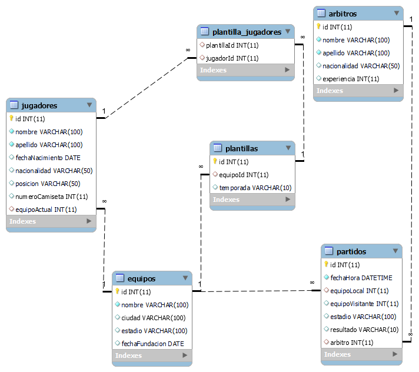

# Inserción de Datos en Base de Datos de Fútbol

Este proyecto consiste en un script de Python que utiliza la biblioteca `Faker` para generar datos ficticios e insertarlos en una base de datos MySQL diseñada para un sistema de gestión de fútbol. El objetivo es proporcionar una base de datos de ejemplo que simule un entorno real de gestión de equipos, jugadores y árbitros.

## Estructura de la Base de Datos

La base de datos contiene las siguientes tablas:

### 1. Equipos

| Columna         | Tipo              | Descripción                                    |
|------------------|------------------|------------------------------------------------|
| `id`             | INT (PK, AUTO_INCREMENT) | Identificador único para cada equipo.         |
| `nombre`         | VARCHAR(100)     | Nombre del equipo.                             |
| `ciudad`         | VARCHAR(100)     | Ciudad donde se encuentra el equipo.          |
| `estadio`        | VARCHAR(100)     | Nombre del estadio del equipo.                 |
| `fechaFundacion` | DATE             | Fecha de fundación del equipo.                |

### 2. Jugadores

| Columna           | Tipo              | Descripción                                    |
|--------------------|------------------|------------------------------------------------|
| `id`               | INT (PK, AUTO_INCREMENT) | Identificador único para cada jugador.       |
| `nombre`           | VARCHAR(50)      | Nombre del jugador.                           |
| `apellido`         | VARCHAR(50)      | Apellido del jugador.                         |
| `fechaNacimiento`  | DATE             | Fecha de nacimiento del jugador.              |
| `nacionalidad`     | VARCHAR(50)      | Nacionalidad del jugador.                     |
| `posicion`         | VARCHAR(50)      | Posición del jugador en el campo.             |
| `numeroCamiseta`   | INT              | Número de la camiseta que usa el jugador.     |
| `equipoActual`     | INT (FK)        | ID del equipo actual (referencia a `equipos.id`). |

### 3. Árbitros

| Columna           | Tipo              | Descripción                                    |
|--------------------|------------------|------------------------------------------------|
| `id`               | INT (PK, AUTO_INCREMENT) | Identificador único para cada árbitro.      |
| `nombre`           | VARCHAR(50)      | Nombre del árbitro.                           |
| `apellido`         | VARCHAR(50)      | Apellido del árbitro.                         |
| `nacionalidad`     | VARCHAR(50)      | Nacionalidad del árbitro.                     |
| `experiencia`      | INT              | Años de experiencia como árbitro.             |

## Diagrama de la base de datos


## Requisitos

Para ejecutar este proyecto, necesitarás:

- Python 3.x
- MySQL
- Biblioteca `mysql-connector-python`
- Biblioteca `Faker`

### Instalación

Para instalar las bibliotecas necesarias, ejecuta:

```bash
pip install mysql-connector-python faker


